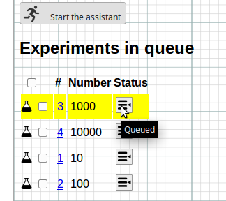

# A library for managing experiments

If you are doing research in Computer Science, it is very likely that every now and then, you need to run experiments on your computer. LabPal is a Java library that allows you to quickly setup an environment for running these experiments, collating their results and processing them in various ways: generating tables, data files, plots, etc.

## Features

- All your experimental setup (including your code, its input files and library dependencies) can be bundled into a **single, runnable JAR** file, making it easy for anybody to download and re-run your experiments.
- The runnable JAR acts as a **web server**; when launched, a user can see all the experiments and control their execution using a web browser.
- Automated generation of PDF and PNG **plots** (using [GRAL](http://trac.erichseifert.de/gral) or [Gnuplot](http://gnuplot.info)) and **tables** (in beautified LaTeX, HTML or CSV).
- Each running experiment can update a visual **progress bar**; LabPal can even estimate and show the time remaining before they complete.
- A set of partially executed experiments can be saved to disk, then **reloaded and resumed** at a later time (or even on a different machine).

All these features are available in less than **30 lines** of Java code. See the example below!

## Why use LabPal?

To run experiments on a computer, you probably already write command-line scripts for various tasks: generating your data, saving it into text files, process and display them as plots or tables to include in a paper or a presentation. But soon enough, your handful of "quick and dirty" batch files becomes a bunch of arcane, poorly documented scripts that generate and pass around various kinds of obscure temporary files. This situation brings two important problems in terms of research methodology:

- **Problem 1: no one can reproduce your experiments.** Too much cleaning up would be required to your setup before anybody else could understand how it works, so chances are you'll never make your scripts and data publicly available.

- **Problem 2: you waste your time.** Most of your batch and data files are so specific to your experiments that even yourself are unlikely to reuse them on your next project; you'll start from scratch instead. This is not a very productive use of your time.

## Learn LabPal in five minutes

LabPal is easy enough to use that you can get up and running in a couple of minutes. Below is a minimal, but **complete** set of experiments for LabPal in less than 30 lines of code:

  
class MyLaboratory extends Laboratory {

  public void setup() {
    ExperimentTable t = new ExperimentTable("Number", "Time");
    for (long n : new long[]{22602052667l, 42602051897l, 63612552733l, 84612554431l})
      add(new MyExperiment(n), t);
    add(t).add(new Scatterplot(t));
  }

  class MyExperiment extends Experiment {
    public MyExperiment(long n) {
      setInput("Number", n);
    }
    
    public void execute() {
      BigInteger n = new BigInteger(Long.toString(readLong("Number")));
      long start = System.nanoTime();
      boolean b = n.isProbablePrime(1);
      long end = System.nanoTime();
      write("Time", end - start);
    }
  }
  
  public static void main(String[] args) {
    initialize(args, MyLaboratory.class);
  }
}


In a nutshell:

- Method `setup` creates a new *laboratory*, where we create a few *experiments* with different input parameters, assocaite them to a data *table*, and create a *plot* which will be drawn from the table.
- When instantiated, our experiments declare a number as an input parameter. When executed, the experiment reads this number, checks if it is prime, and writes as an output parameter the time it has taken to do that.

What do we get in exchange for these 30 lines of code? Compile and run this file using the `--web` command-line argument. You should see a message telling you to visit `http://localhost:21212/index` in your browser.

If you go there, you'll see something like this:

The web interface contains a few pages, which you can access through the buttons at the top. Go to the *Experiments* page; there you see the list of the experiments that have been added to the lab, with the "Number" parameter that was assigned to each. The "thumbs up" icon indicates that they are ready to run. 

Select them all by clicking on the topmost checkbox, and then click on the *Add to queue* button at the bottom. You have now put these experiments in the queue, waiting to be executed. Now visit the *Lab assistant* page: this is where you manage this queue.

Click on *Start the assistant* to launch the batch execution of all the experiments you selected. These experiments run very quickly; if you go to the to the *Status* page, you'll see that they are all done:

The experiments have produced results, which we have put in a table. Go to the *Tables* page, and click on the (only) table you see there, called "Table 1". There you see the results of the experiments:

In the tables page, note that you can also export the contents of that table in various formats (HTML, CSV, and LaTeX).

Finally, go to the *Plots* page to see the plot that has been created from that table:

You see the plot that was created; click on it to view it full size. You can also export the plot as a PDF file; a button at the top also offers you the option to bundle all the available plots into a single, multi-page PDF.

## That's it! Or not...

These are just some of the features you get for writing these 30 lines of code. Among other things you get for free:

- If you created your lab using our [template project](https://github.com/liflab/labpal-project), you can use Ant to compile and generate a **stand-alone JAR** file of your lab you can give to anybody so they can run these experiments by themselves (just type `ant` and you are done).
- For a few more lines of code, the input/output parameters can come with a small **textual description** that is displayed in the web interface, so that a user can understand the meaning of each data element. You can do the same with the lab itself, and each experiment it contains.
- You can perform transformations to the tables before plotting them, and also customize the display of your plots (scales, colors, labels) very easily.

## I want to use LabPal!

- Just [download the latest release](https://github.com/liflab/labpal/releases/latest) and include it in your classpath.
- Or download our [template project](https://github.com/liflab/labpal-project) that includes a few extra features (like a boilerplate Readme and Ant build script).

If you want to know more about LabPal's features:

- Read the short [tutorial](quick-tutorial.html)
- Look at our [lab examples](https://github.com/liflab/labpal/tree/master/Source/Examples/src) to learn how to use various features
- Look at our slightly longer [instructions](instructions/)
- Consult the online [API documentation](doc/)

<!-- :wrap=soft:mode=markdown: -->